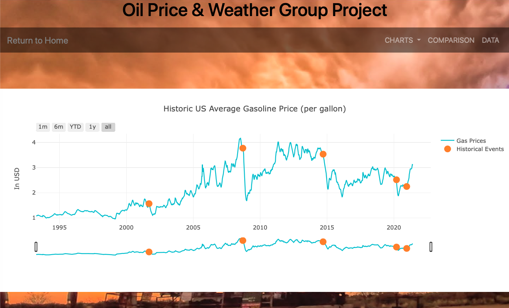
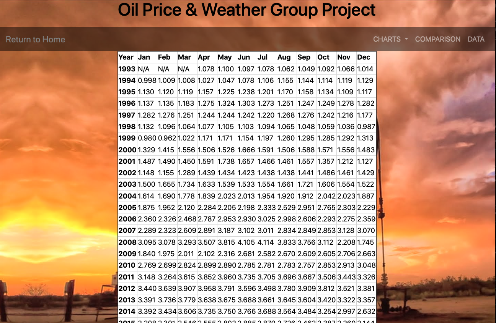
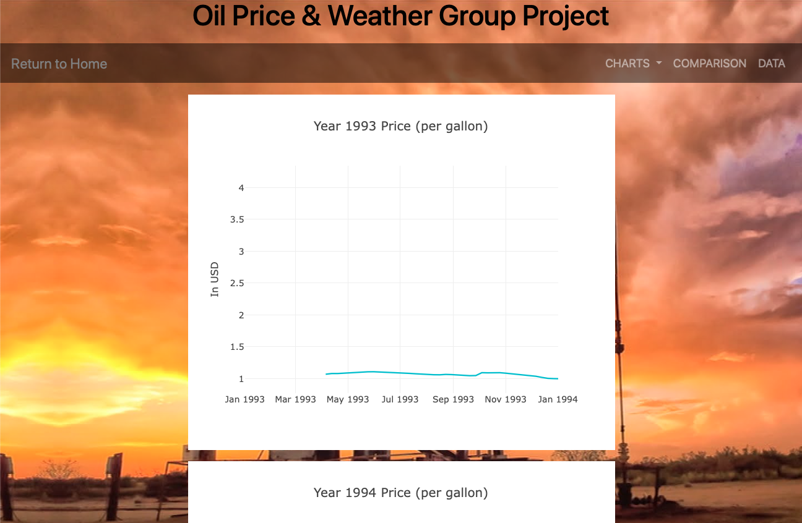

# Project2-OilPriceWeather

## [Click HERE for Powerpoint Presentation](docs/Project2_GasPrices.pptx)

## How to Run
This program runs through Python Flask as a simple web server with routes with MongoDB as data store.
1. Start MongoDB.  If you installed MongoDB through Homebrew, run `brew services start mongodb/brew/mongodb-community`
2. Run Flask app. Run `python ./app.py`.  This will start Flask app in debugging mode.  
3. Import CSV file in resources into MongoDB by visiting http://localhost:5000/importdata  Once data is loaded, it will redirect you back to the main page.
4. You can access local web session via http://localhost:5000 and browse through the onscreen menu.

## Screenshots of Pages
Historic US Gas Price Chart

Monthly Avg US Gas Price Table

Yearly US Gas Price Charts

